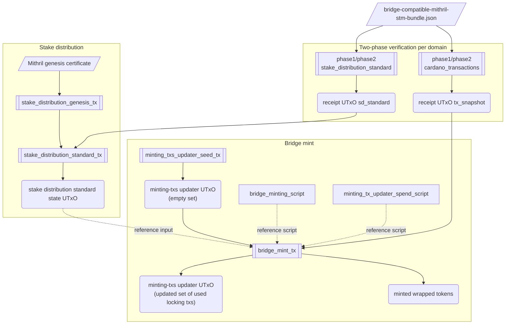

# Bridge Flow Diagram

This document supersedes the previous version of the diagram, which had
become out of sync with the actual flow.

## What milestone 6 changed

The shape of the flow shown below is driven by three changes introduced
in milestone 6:

1. **Mithril STM proof verification is split into two phases.** A
   single Plutus transaction cannot afford the execution units required
   to verify a Mithril multi-signature SNARK in one shot, so the
   verification is partitioned across two consecutive transactions,
   `phase1_setup` and `phase2_verify`. This transactions share state through a
   datum. `phase1` does the cheap setup work (transcript challenges,
   commitments, etc.) and `phase2` runs the expensive pairing check
   that finishes the SNARK.

2. **NFTs are used as receipts of a verified proof.** A successful
   `phase2_verify` produces a `proof_receipt` UTxO that holds an NFT
   bound to the verified statement. The downstream transactions that
   still depend on Halo2-backed proof receipts
   (`stake_distribution_standard_tx` and `bridge_mint_tx`) do not
   re-verify the SNARK — they only require the matching
   `proof_receipt` UTxO to be present, so the cost of "having proven X"
   is paid once and then reused by any transaction that consumes the
   receipt. `stake_distribution_genesis_tx` is the exception: it is now
   authenticated directly by the Aiken genesis-certificate path and doesn't 
   consume a proof receipt.

3. **Heavy validators are deployed as reference scripts.** Inlining
   the Mithril STM verifier and the bridge validators into every
   transaction would push them over Cardano's per-transaction size
   limit. Instead, those scripts are published once into reference
   UTxOs (e.g. `publish_proof_receipt_reference_script`) and the
   downstream transactions pull them in as `reference_input`s rather
   than carrying the script bytes themselves.

## Current snapshot

The verified workflow today no longer uses:

- a single `proof receipt`
- a single `statement_hash`
- `proof_receipt` as a `reference input`

The current flow uses:

- 3 distinct Mithril certificate/proof domains
  - `stake_distribution_genesis`
  - `stake_distribution_standard`
  - `cardano_transactions`
- 1 shared `publish_phase1_reference_script` tx for the whole `phase12-all` run
- 2 separate runs of `phase1_setup -> phase2_verify`
  - `stake_distribution_standard`
  - `cardano_transactions`
- each run now uses dedicated synthetic source/collateral UTxOs so the
    shared local Dolos process can reuse the one published `Phase1` reference
    script safely across the remaining Halo2 domains
- 2 distinct `proof receipt` UTxOs, one for each run of `phase1_setup -> phase2_verify`
- `proof receipt` consumed as a regular `input`
- a reference script published for the `proof_receipt` validator

## High-level view

## How the transactions are built

The flow has three logical stages: a one-shot **setup**, a
**verification** stage that runs once per Mithril proof domain, and a
**runtime** stage that consumes the verification receipts to drive
the stake distribution and the bridge mint. Transactions must be
submitted in an order consistent with the dependencies drawn in the
diagram above.

### 1. Setup — `publish_proof_receipt_reference_script`

Runs once at the beginning of the bridge's lifetime.

- **Outputs:** the `proof_receipt` reference-script UTxO (`prs`).
  Every later transaction that needs to evaluate the `proof_receipt`
  validator pulls `prs` in as a reference script instead of inlining
  the script bytes.

For simplicity, this step is not included in the diagram above.

### 2. Verification — `phase1_setup` → `phase2_verify` (×2)

Runs once per Halo2-backed Mithril proof domain
(`stake_distribution_standard`, `cardano_transactions`), for a total
of two domain-specific `(phase1, phase2)` pairs. The two phases
must execute sequentially and share the cryptographic state through
a datum (`phase1` writes the datum, `phase2` consumes it).

The executable `phase12` domains correspond to different Mithril signed
entities:

- **`stake_distribution_standard`** — subsequent stake-distribution
  certificates that chain against the previous one (parent → child)
  and update the trusted parent state the bridge references on every
  mint.
- **`cardano_transactions`** — Mithril's own naming for the
  certificate that signs the Merkle root of a snapshot of Cardano
  transactions up to a given epoch. The bridge uses it to prove that
  a specific locking transaction was included in that snapshot.

Each domain is built taking data from the off-chain proof export bundle
  `bridge-compatible-mithril-stm-bundle.json`, whose
  `proofs.sd_standard` / `proofs.cardano_transactions` entries feed the
  redeemers of the
  corresponding `(phase1, phase2)` pair.
- **Outputs of each `phase2_verify`:** a `receipt` UTxO (`rs`
  or `rt` depending on domain) holding an NFT bound to the verified
  `statement_hash`. Possessing this UTxO is the on-chain proof that
  the corresponding Mithril statement has been verified.

### 3. Stake-distribution chain — `sdg` then `sds`

Two transactions build the trusted parent state that the bridge mint
later references.

- **`stake_distribution_genesis_tx` (`sdg`):**
  - **Inputs:** no `proof_receipt`; only the funding / collateral inputs
    required to mint the first stake-distribution NFT-bearing UTxO.
  - **Aiken certificate check:** verifies the Mithril `GenesisSignature`
    against the hardcoded Mithril genesis verification key from
    `env/default.ak`.
  - **Outputs:** the genesis stake-distribution UTxO consumed by
    `sds`.
- **`stake_distribution_standard_tx` (`sds`):**
  - **Inputs:** `receipt UTxO sd_standard` (`rs`) plus the output of
    `sdg` (or of the previous `sds` in a longer chain).
  - **Inline witness:** `ProofReceipt`.
  - **Outputs:** the `stake distribution standard state UTxO`
    (`sdstate`) — the trusted parent certificate referenced by the bridge mint.

### 4. Locking-txs updater chain — `seed` then `updater`

Two transactions produce the locking-txs updater state consumed by
the bridge mint. This chain is independent of the stake-distribution
chain and can run in parallel with it.

- **`locking_txs_updater_seed_tx` (`seed`):** prepares a wallet UTxO
  that `updater` will later consume as its `unique_mint_source`. This
  is the one-shot anchor that makes the `LockingTxsUpdaterMint`
  policy mintable exactly once: the policy requires the genesis tx
  to spend this specific UTxO, and once spent it cannot be replayed.
  - **Outputs:** the seed UTxO consumed by `updater`.
- **`minting_txs_updater_seed_tx` (`updater`):**
    - It will be the initial transaction that will represent an empty set (no locking transactions were minted yet).
  - **Inputs:** the seed UTxO output by `seed`.
  - **Outputs:** the locking-txs updater UTxO consumed by the bridge minting tx described below. 
  It will contain a merkle root representing an empty set.

### 5. Bridge mint — `bridge_mint_tx` (`bm`)

The final transaction that mints the wrapped tokens.

- **Inputs:** `receipt UTxO tx_snapshot` (`rt`) and the output of
  `updater` (it can be the output of the `minting_txs_updater_seed_tx` or a prior `bridge_mint_tx`).
- **Reference inputs:** `sdstate` — provides the trusted parent
  stake-distribution state without consuming it.
- **Inline witness:** `ProofReceipt`.
- **Outputs:**
  - the minted wrapped tokens.
  - a new locking-txs updater UTxO reflecting the updated set of
    used locking transactions: its merkle root now includes the
    locking tx minted by this transaction. This UTxO supersedes the
    one produced by `updater` and is the one a subsequent
    `bridge_mint_tx` would consume in its place.

## Source of truth

The diagram and the prose above are summaries. For the current
operational wiring, the files below (read them in this order) are
authoritative.

1. **`main.tx3`** — the Tx3 source. Declares the on-chain parameters
   the rest of the flow runs against and the 12 `tx` templates the
   scripts call into. Anything the bash scripts assemble at runtime
   is bound to a template defined here.

2. **`scripts/bridge.sh`** — the operator entrypoint. A small
   dispatcher that exposes the high-level commands an operator
   actually runs (`bootstrap`, `workspace`, `tooling`, `doctor`,
   `check`, `run`) and delegates the heavy lifting to the scripts
   below. If you want to know what a developer is *supposed* to type,
   start here.

3. **`scripts/run_mithril_poc.sh`** — the integrated end-to-end
   runner driven by `bridge.sh run`. Wires together the off-chain
   proof export build, the preflight/tooling checks, and the bridge
   minting flow into a single reproducible sequence — the closest
   thing to "press one button and produce a real bridge mint tx".

4. **`scripts/mithril_stake_distribution.sh`** — drives the
   stake-distribution sub-flow: the `phase1_setup` / `phase2_verify`
   pair for the `sd_standard` Mithril domain plus the `sdg` / `sds`
   runtime transactions that update the trusted parent state
   (`sdstate`). The genesis bootstrap is now authenticated directly by
   `stake_distribution_genesis_tx` through the Aiken certificate path.

5. **`scripts/bridge_minting.sh`** — drives the bridge-mint
   sub-flow. Depends on `mithril_stake_distribution.sh` (the trusted
   parent must already be in place), then runs the
   `cardano_transactions` `(phase1, phase2)` pair and submits
   `bridge_mint_tx`.
