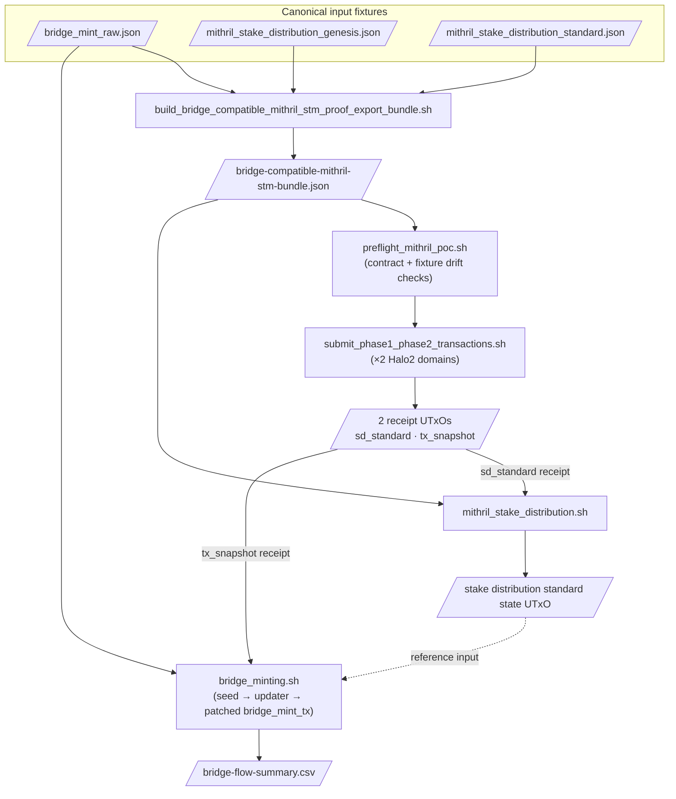

# Local Testing Scheme

This document describes how the bridge is tested end-to-end on a local
machine: which scripts orchestrate the flow, what each one does, and how
they fit together. It does not cover the on-chain logic itself (see
[`BRIDGE_FLOW_DIAGRAM.md`](BRIDGE_FLOW_DIAGRAM.md) and
[`2_phase_mithril_stm_verification.md`](2_phase_mithril_stm_verification.md)
for that), only the test harness around it.

## What "local testing" means here

The bridge mint depends on a long chain of artifacts and transactions:
a Mithril STM proof bundle, two Halo2-backed phase-1/phase-2 verification
cycles, a stake-distribution chain, several reference-script
publications, and finally the bridge mint itself. Running this against
public testnets would be slow and expensive. Instead we run it against a
**local Dolos 1.2.0 node** driven from the installed binary plus the
repo-local `.tx3/dolos` scaffolding, which we can inspect, replay and tear
down at will.

## High-level flow

What `./scripts/bridge.sh run` orchestrates, at a glance:


### Flow inputs

Everything in the diagram flows out of the **canonical input fixtures**
in the top box: three JSON files under `scripts/data/`
(`bridge_mint_raw.json`, `mithril_stake_distribution_genesis.json` and
`mithril_stake_distribution_standard.json`). They contain data that represents the bridge-mint event
plus the genesis and standard stake-distribution certificates that are used to prove that the event is valid.
Certificate information was captured real data captured from a Mithril aggregator, then frozen and checked into 
the repo as the source of truth for the local test scenario. Pinning them this way is what makes the run
reproducible and idempotent: the builder fingerprints these inputs and
every downstream artifact, proof and transaction is derived from them
rather than from anything fetched live, so the same inputs always produce
the same bundle and the same on-chain results. All three are the inputs
of the Mithril STM proof-export bundle builder. `bridge_mint_raw.json` is additionally
read directly by `bridge_minting.sh` for the bridge-ZK data the Mithril
bundle does not carry. See [Canonical input fixtures](#canonical-input-fixtures) below for
the per-file breakdown.

### Scripts description

The five high-level scripts in the diagram are:

| Script | What it does |
| --- | --- |
| `build_bridge_compatible_mithril_stm_proof_export_bundle.sh` | Runs the halo2 verifier off-chain over the canonical inputs to produce `bridge-compatible-mithril-stm-bundle.json` (multi-proof). Idempotent via input fingerprint. |
| `preflight_mithril_poc.sh` | Validates the bundle's contract invariants and that the on-disk fixtures (`bridge_fixture.ak`, `cardano_transactions.ak`, reference snapshot) are aligned with the freshly-built bundle. |
| `submit_phase1_phase2_transactions.sh` | Loops over the 2 Halo2-backed Mithril proof domains (`stake_distribution_standard` and `cardano_transactions`). For each one, submits `phase1_setup` and `phase2_verify` against the local Dolos runtime, producing a receipt UTxO that proves the corresponding Mithril statement was verified on-chain. |
| `mithril_stake_distribution.sh` | Builds the stake-distribution chain (`stake_distribution_genesis_tx` → `stake_distribution_standard_tx`), ending in the trusted parent state UTxO that the bridge mint will reference. In the current flow, only the standard step consumes a `proof_receipt`; genesis is authenticated directly from the Mithril genesis certificate via Aiken. |
| `bridge_minting.sh` | The final stage: publishes locking reference scripts, runs the locking-txs-updater chain, and submits the `bridge_mint_tx`. Includes the local `tools/patch_bridge_mint_tx/` post-build step (re-injects measured ex-units, fee and hashes after Tx3 placeholders) and the final re-sign + submit. |

Each tx submission goes through `tx3-resolver` (template → CBOR), then
`cshell` (sign + submit) against the local Dolos node. After each
submission, `tx_publish_summary.py` writes the `.tx`,
`.sim_inputs` and `.resolved_inputs` triplet next to the result, so any
tx can be replayed off-line with `dolos eval` / `dolos validate` style
inspection against the installed runtime. `write_bridge_flow_csv.py` aggregates everything at the end
into `bridge-flow-summary.csv`.

## The Mithril STM bundle

The test pipeline funnels everything through a single **bridge-compatible
Mithril STM bundle**: a JSON that holds, per Mithril domain
(`stake_distribution_genesis`, `stake_distribution_standard`,
`cardano_transactions`), the inputs of the SNARK (STM parameters,
registration, witness, statement, certificates) and the corresponding
outputs (serialized proof bytes plus pre-computed intermediate state —
`phase1_state` and `reduced_redeemer`) that the on-chain Aiken
validators need to verify the proof split across two transactions.

A single off-chain step builds this bundle:
**`build_bridge_compatible_mithril_stm_proof_export_bundle.sh`** (the **builder** 
from now on). It reads three canonical input fixtures, runs the halo2 
verifier off-chain over them, and emits the bundle. It is idempotent 
via an input fingerprint, so it only rebuilds when one of those inputs 
changes. The two subsections below describe, respectively, what the builder 
reads and what it produces.

### Canonical input fixtures

These three JSON files under `scripts/data/` are the **inputs** the
builder reads. They are checked into the repo and treated as the source
of truth for the local test scenario.

- **`bridge_mint_raw.json`** — the raw data describing the bridge-mint
  event from the Cardano side: canonical locking transaction body fields,
  the resulting real Cardano locking-tx hash
  (`blake2b_256(tx_body_CBOR)`), the Cardano-transactions merkle root that
  the child Mithril certificate signs, the new merkle root after the update,
  packed public inputs and proofs for the two bridge ZK circuits (tx
  snapshot inclusion + tx set update). The canonical locking-tx hash is
  derived by `tools/build_canonical_locking_tx`, and the Aiken minting
  validator reconstructs and hashes the same body on-chain before accepting
  the mint. It feeds the builder as the `signed_message` for the
  `tx_snapshot` bundle, and is also read directly by `bridge_minting.sh` for
  the bridge-ZK data that the Mithril bundle does not carry
  (`locking_tx_hash`, `minting_merkle_proof`, `tx_set_update_proof`, ...).
- **`mithril_stake_distribution_genesis.json`** — the genesis Mithril
  stake-distribution certificate (bootstrap, `prev_hash = 0x`): hash,
  epoch, aggregate verification keys, signed message, signature,
  protocol parameters. Provides the `signed_message` for the `sd_genesis`
  bundle.
- **`mithril_stake_distribution_standard.json`** — a subsequent Mithril
  stake-distribution certificate, chained against the genesis one by
  `prev_hash`. Same shape as the genesis fixture. Provides the
  `signed_message` for the `sd_standard` bundle and the parent
  certificate data that `stake_distribution_standard_tx` consumes
  downstream.

### Builder output

The builder produces a single file consumed by the rest of the flow:

- **`bridge-compatible-mithril-stm-bundle.json`** — multi-proof bundle
  with the
  `proofs.{stake_distribution_genesis, stake_distribution_standard, cardano_transactions}`
  entries (one per Mithril domain used in the flow). The downstream
  Python loaders read the per-domain proof bytes and `bridge_aiken`
  values from this file. Validated strictly by `cargo run
  export_mithril_stm_proof_export -- --check` against the bundle contract
  (statement-hash invariants, `phase1_state.reduced_hash ==
  blake2b_256(reduced_redeemer)`, certificate chaining, etc), applied
  once per proof entry.

## How to run the flow

The diagram above is driven by a single entry point (`run_mithril_poc.sh`),
with a flag that selects how strict you want to be:

- **`./scripts/bridge.sh run`** — the executor.
  Pipeline: `build proof-export bundle → aiken check → preflight → bridge flow`.
  Both `aiken check` and the preflight are skippable
  (`--skip-aiken-check` / `--skip-preflight`). Good for fast local
  iteration when you already trust the repo state.
- **`./scripts/bridge.sh run --strict`** — the strict variant,
  recommended for CI-like local validation. Forces the preflight (it rejects
  the `--skip-preflight` flag) and runs that step *before* `aiken check`. Use this to guarantee the preflight ran before
  anything else touches the local Dolos node.
- 
## Final summary

One output of the `bridge.sh` script is a file named **`bridge-flow-summary.csv`**.  
This per-transaction CSV is written at the end of the run by `write_bridge_flow_csv.py`. 
It contains one row per submitted tx with hash, size, CPU budget and memory budget,
aggregated from the per-tx summaries emitted by `tx_publish_summary.py` after each submission.

## Common commands

```bash
# Initial setup (once per workstation)
./scripts/bridge.sh bootstrap --link
uv sync

# Sanity checks
./scripts/bridge.sh doctor check

# Build the canonical Mithril proof-export bundle
./scripts/bridge.sh proof-export-bundle

# Full integrated run
./scripts/bridge.sh run

# Stricter variant (recommended for CI-like local validation)
./scripts/bridge.sh run --strict

# Just the phase-1/phase-2 cycle for one domain
./scripts/bridge.sh phase12 cardano_transactions

# Just the two Halo2-backed phase-1/phase-2 domains
./scripts/bridge.sh phase12-all

# Just the bridge mint (assumes prior stages produced their artifacts)
./scripts/bridge.sh bridge
```
